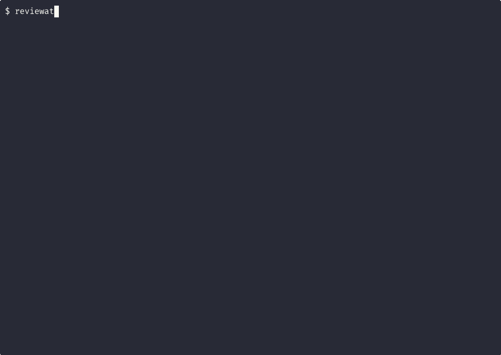
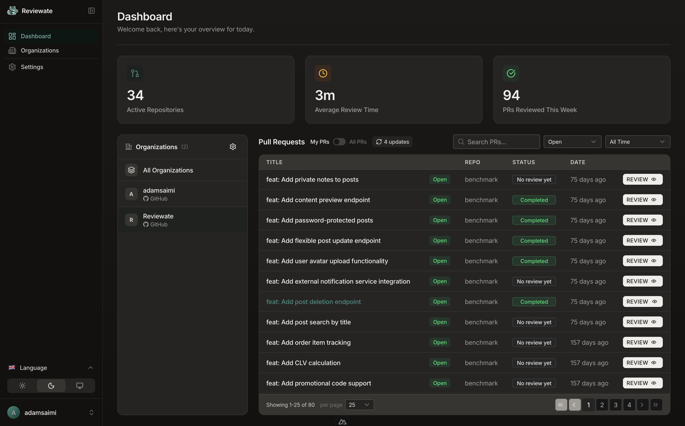

<p align="center">
  
</p>

<h1 align="center"><a href="https://reviewate.com">Reviewate</a></h1>

<p align="center">
  <strong>Open-source AI code reviewer for GitHub and GitLab</strong>
</p>

<p align="center">
  <a href="https://reviewate.com/docs/getting-started/quickstart">Quickstart</a> ·
  <a href="https://reviewate.com/docs/getting-started/self-hosting">Self-Hosting</a> ·
  <a href="https://reviewate.com/docs/getting-started/introduction">Docs</a>
</p>

Reviewate is an AI agent that reviews your pull requests. Built on the [Claude Agent SDK](https://github.com/anthropics/claude-code-sdk-python), it uses a multi-agent pipeline to analyze code changes, explore your codebase for context, fact-check every finding, and post actionable feedback directly on PRs.

<p align="center">
  
</p>

## Quick Start

```bash
pip install reviewate
reviewate https://github.com/org/repo/pull/122
```

Uses your `gh`/`glab` login. First run prompts for model config.

## Self-Hosting

Run Reviewate on your own infrastructure with a full dashboard, webhooks, and team management.

<p align="center">
  
</p>

[Self-hosting guide →](https://reviewate.com/docs/getting-started/self-hosting)

## Documentation

- **[Quickstart](https://reviewate.com/docs/getting-started/quickstart)** — Install and run your first review
- **[Self-Hosting](https://reviewate.com/docs/getting-started/self-hosting)** — Dashboard, webhooks, and isolated container execution
- **[Deployment](https://reviewate.com/docs/deployment/docker-compose)** — Docker Compose, Kubernetes, CI/CD
- **[Configuration](https://reviewate.com/docs/configuration/environment-variables)** — LLM providers, models, authentication
- **[Architecture](https://reviewate.com/docs/architecture/overview)** — Multi-agent pipeline, security model
- **[Contributing](CONTRIBUTING.md)** — Development setup and conventions

## License

AGPL-3.0
